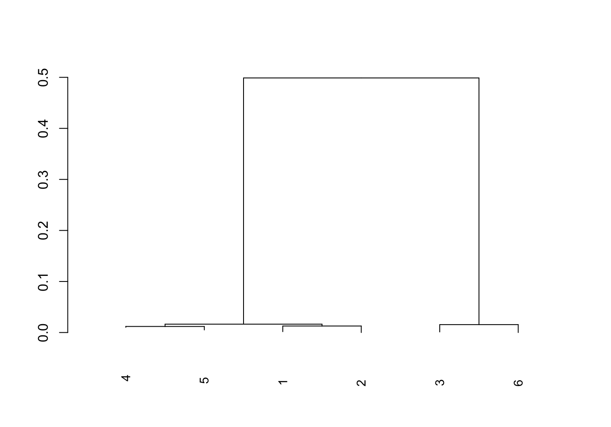

# BIO-410-Final-Project

# Comparative Analysis of Viral Genomes

## Background
To identify which organism the data belonged to, the sequences were analyzed using BLAST. The data consists of 6 samples from the Zaire Ebola virus. Ebola virus is a single-stranded RNA that causes ebola virus disease, a severe and often fatal illness. This disease has primarly affected the sub-Saharan African populations. 

Reference) https://pubmed.ncbi.nlm.nih.gov/26175035/

## Purpose
The purpose of this project was to create a phylogenetic tree from 6 samples of Zaire ebolavirus to determine their evolutionary relationships.

## Methods
Viral genome sequencing reads were obtained using next generation sequencing (NGS) containing six samples. Genome assembly was performed using MEGAHIT to generate contigs for each sample. The contigs generated were combined into a dataset in R and those larger than 5000kbp were aligned using the AlignSeqs function in the DECIPHER package. The BrowseSeqs function was used to look at the alignment. The phylogenetic tree was constructed using the TreeLine function with Maximum Liklihood (ML).

## Results
The phylogenetic tree shows that samples 4 and 5, 1 and 2, and 3 and 6 are most closely related to eachother. It's likely these 6 samples came from 2 individuals based on the phylogenetic tree.

